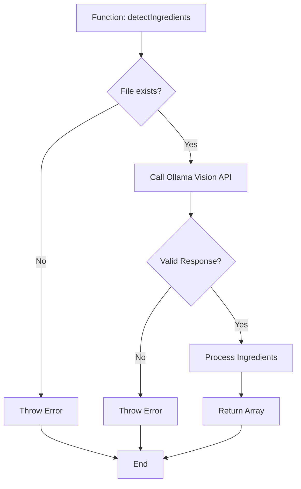
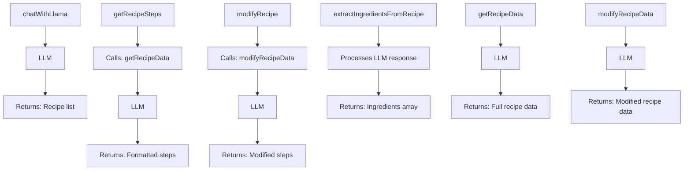
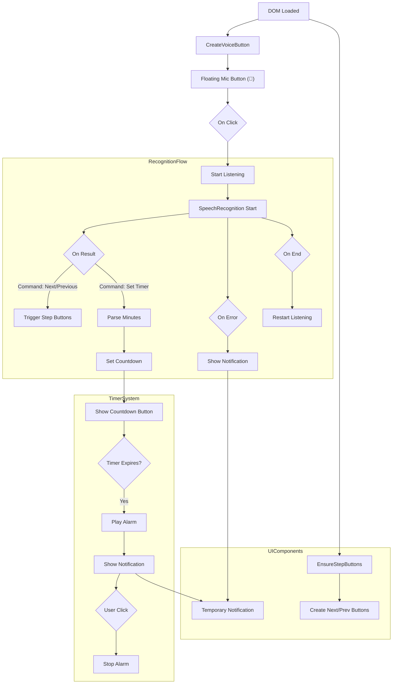
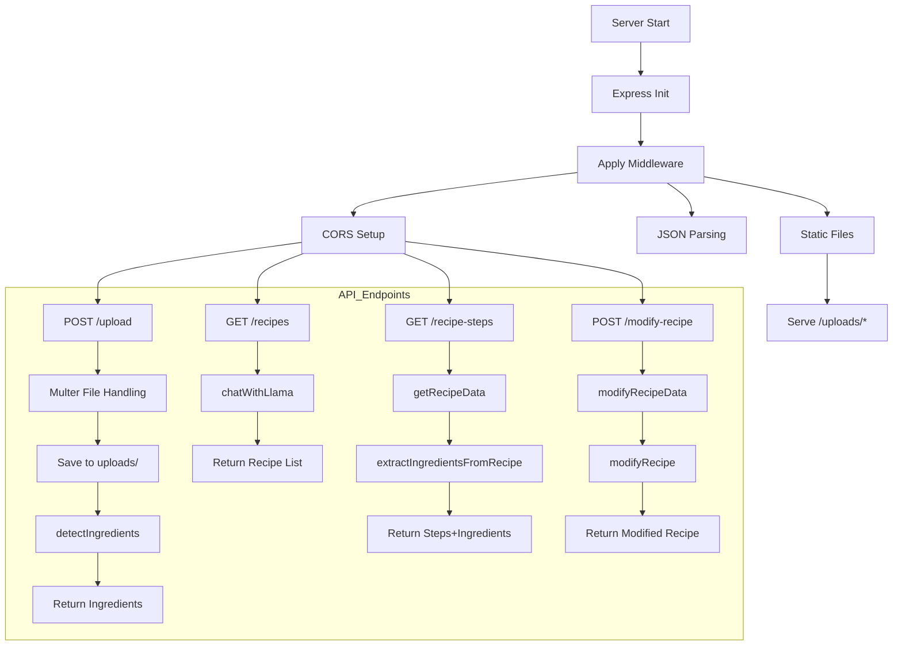
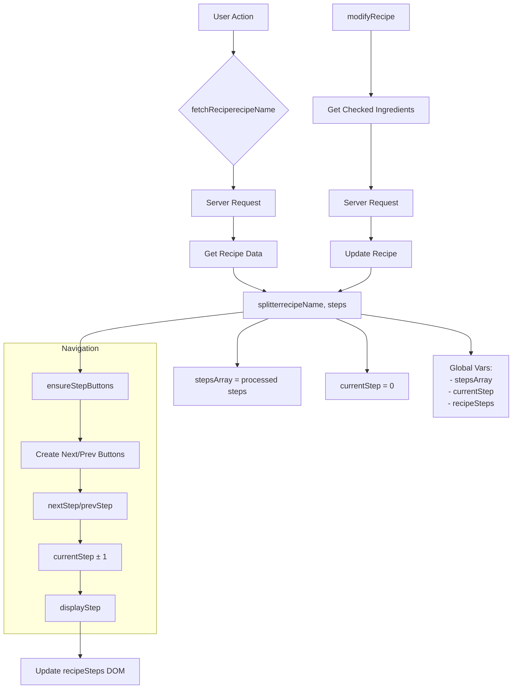
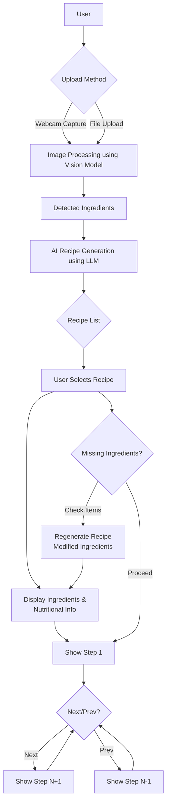

# DetectN'-Dine

## All the versions so it'll be easy to run 
built in node v20.11.1
npm version=10.2.4
nvm version=1.2.2

## Setup and Running 

1. Installing Node.js
You can use NVM to manage multiple versions of node.  Get them from, for Linux: https://github.com/nvm-sh/nvm and for Windows: https://github.com/coreybutler/nvm-windows after installlation go to the respective directory run 
```bash
npm i
``` 

3. Download ollama from https://ollama.com/ and install it 

4. install the used models by running this following cmd in promptshell
   
``` bash
ollama pull [MODEL_NAME]
```

4. if you are using git, clone this repo by running
```bash
git clone https://github.com/Feininon/Detect-n-Dine
```
or Download it and unzip it.

5. make sure ollama is running, if not run
```bash
ollama serve
```

6.open the terminal for the directory run the _server.js_ file by,
```bash
node server.js
```

7.once the server is running, open the indexZ.html file in browser, and it will be running.

## what all the scripts do:

### _detectings.js_

this script defines a function `detectIngredients` that takes an image path as a parameter and uses an external
library called 'ollama' to analyze the image and identify any food items present in it. 

1. At the top, we import Node.js's built-in `fs` module and the 'ollama' library using ES6 syntax (const and import statements).
2. The script defines a function `detectIngredients` that takes an image path as a parameter.
3. Inside the function, we check if the provided image file exists. If it doesn't exist, an error is thrown.
4. It then logs a message indicating that the image is being processed.
5. Inside a try-catch block, we call the `chat()` function from the 'ollama' library. We pass in several parameters:

   a. The model to use for analysis (in this case, `llama3.2-vision`)

   b. An array of messages that includes a prompt for Ollama to list the food items it detects and an image path as part of the prompt.

7. If the response from Ollama is invalid (i.e., doesn't have a content property), an error is thrown.
8. If the response is valid, we extract the list of ingredients by splitting the response content into lines and trimming each item.
9. Finally, we log the detected ingredients and return them from the function.
10. The script ends by exporting the `detectIngredients` function for other modules to use.



### _chat.js_
contains the following functions.

1. `chatWithLlama` - This function initiates a conversation with the LLM (Language Learning Model) to perform
tasks related to recipes, such as fetching recipe data, modifying recipes, etc. The function takes no arguments.
2. `getRecipeSteps` - This function fetches step-by-step instructions for making a specific recipe from the LLM.
The function takes the recipe name as an argument.
3. `modifyRecipe` - This function modifies the instructions for making a specific recipe to accommodate missing
ingredients, according to the LLM's response. The function takes the recipe name and a list of missing ingredients
(in the form of ModimissingIngredients) as arguments.
4. `extractIngredientsFromRecipe` - This function extracts all the ingredients used in a specific recipe from the
LLM's response. The function takes the recipe name as an argument and returns a list of extracted ingredients (no
quantities).
5. `getRecipeData` - This function fetches complete recipe data, including ingredients, nutritional values, etc.,
from the LLM for a given recipe. The function takes the recipe name as an argument and returns the formatted
recipe data.
6. `modifyRecipeData` - This function modifies the recipe data to reflect changes in the recipe (e.g., removing
ingredients that are no longer needed due to missing ingredients). The function takes the recipe name and a list
of missing ingredients (in the form of missingIngredients) as arguments and returns the modified recipe data.
7. All the functions are exported from the module using the `module.exports` object, so they can be imported and
used in other parts of the application.





### _timer.js_

This JavaScript code sets up a voice recognition system using the Web Speech API. The user can interact with the
application by speaking commands, such as "next", "previous", or "Set alarm for 5 minutes". 

1. Voice Recognition Setup:
   - The code checks browser support for speech recognition and sets up an instance of `SpeechRecognition` with
specific properties like language, continuous listening, interim results, maximum alternatives, etc.
   - An audio file ("ooo.mp3") is loaded to be used as the alarm sound.

2. Handling Audio:
   - The audio element (alarmSound) is created and an event listener is added for the "DOMContentLoaded" event.
When the page loads, the `createVoiceButton` and `ensureStepButtons` functions are called.
   - The createVoiceButton function adds a floating voice activation button to the bottom right corner of the
screen. Clicking this button will start the speech recognition.
   - The ensureStepButtons function checks if certain elements exist on the page (step buttons) and creates them
if they don't.

3. Voice Recognition Functions:
   - The `startListening` function is bound to the voice activation button, which starts the speech recognition
when called.
   - Speech recognition events are handled in global functions like onresult, onerror, and onend. These handle
different scenarios such as successful recognition, error handling, or when recognition ends.

4. Notification Function:
   - The `showNotification` function creates a notification element that appears at the bottom right corner of the
screen whenever an event occurs (e.g., speech recognition error).

5. Countdown Button:
   - The countdown button is displayed when an alarm is set using the `showPopupButton`, `updatePopupButton`, and
`removePopupButton` functions. This allows users to see how much time is left before their alarm goes off.

6. Alarm Functions:
   - The `playAlarm`, `stopAlarm`, and `toggleAlarm` functions handle the playback, stopping, and toggling of the
alarm sound.




### _server.js_

This Node.js script sets up an Express server to handle requests related to recipe handling, specifically for
processing images, fetching recipes based on ingredients, extracting recipe steps, modifying recipes, and
displaying static files. 

1. Importing required modules:
   - express: A web application framework for Node.js.
   - multer: Middleware for handling multipart/form-data, which is primarily used for uploading files.
   - cors: Middleware to enable Cross-Origin Resource Sharing (CORS).
   - path: Built-in module that provides utilities for working with file and directory paths.
   - detectIngredients: A function from the "./detectings" module, responsible for analyzing an image and
identifying ingredients.
   - chatWithLlama, getRecipeSteps, modifyRecipe, extractIngredientsFromRecipe, getRecipeData, modifyRecipeData:
Functions from the "./chat" module, used for interacting with an AI model to generate recipes based on user
queries or inputs.
   - ollama: The main instance of the AI model, imported as 'ollama'.

2. Server Initialization:
   - An Express server is created and initialized with CORS, JSON parsing, and static file serving (for uploaded
images).
   - A storage location for uploaded files is specified (./uploads) and served using Express's built-in static
middleware.
   - The server listens on a specific port number (specified by the variable 'port'), logging a success message
upon starting.

3. API Endpoints:

   - /upload: An endpoint for handling image uploads, using Multer to handle form data and store the files in the
specified storage location.
   - /recipe/: The base path for fetching recipes based on ingredients, with subroutes as follows:
      - /: Fetches a list of recipes based on user-provided ingredients.
      - recipe-steps/: Retrieves the recipe steps (and extracted ingredients) for a specific recipe passed in the
query parameters.
   - /modify-recipe: Accepts a POST request to modify an existing recipe, taking both the recipe text and a list
of missing ingredients as input. The function modifies the recipe, extracts new ingredients from it, updates the
missingIngredients list, and returns the modified recipe data.

4. Static file serving: The server serves static files located in './uploads' when requested (for example, when an
image is uploaded).



### _app.js_

This script contains multiple functions that work together to display, navigate, and modify a recipe's steps.
Here's an overview of each function:

1. `splitter(recipeName, steps)`: Takes a recipe name and a string of recipe steps as arguments. It formats the
steps by removing extra line breaks, splitting them into an array, and setting up functions to display the steps
and provide navigation between them. The current step is also initialized to 0.

2. `displayStep()`: Displays the current step for a given recipe.

3. `nextStep()` & `prevStep()`: Function declarations that allow navigation between the steps in a recipe using
buttons. These functions are used by the `splitter` function to enable next and previous step navigation.

4. `ensureStepButtons()`: Ensures that "Next" and "Previous" step buttons exist, recreates them if necessary, and
makes them visible.

5. The `fetch` functions like `fetchRecipe`, `fetchRecipeSteps`, and `modifyRecipe` handle communication with a
server to retrieve recipe data, fetch recipe steps, and modify the recipe by marking missing ingredients. They use
asynchronous requests and error handling.

6. The global variables `stepsArray`, `currentStep`, and `recipeSteps` are used for storing, tracking, and
displaying the recipe's steps.

The parameters and arguments passed to these functions determine their behavior:
- `fetchRecipe(recipeName)` takes a recipe name as an argument and retrieves the corresponding recipe data from
the server.
- `fetchRecipeSteps(recipeName)` takes a recipe name as an argument and fetches the recipe steps for that
particular recipe from the server.
- `modifyRecipe()` does not take any arguments. It marks the missing ingredients in the currently displayed recipe
and sends a request to the server to modify the recipe accordingly.

Event listeners or calls to these functions are likely placed elsewhere in the script (not shown here) to initiate
their execution when needed.



## <ins> Overall Work Flow </ins>




## Credits
### - Prithi Prasanna 
GitHub: @PrithiPrasanna

Mail: prithi.palani58@gmail.com

### - Sai Vignesh 
GitHub: @saivignesh45

Mail: saivignesh742@gmail.com

### - Gokulramanan 
GitHub: @Feininon 

Mail: gokulramananvec@gmail.com


